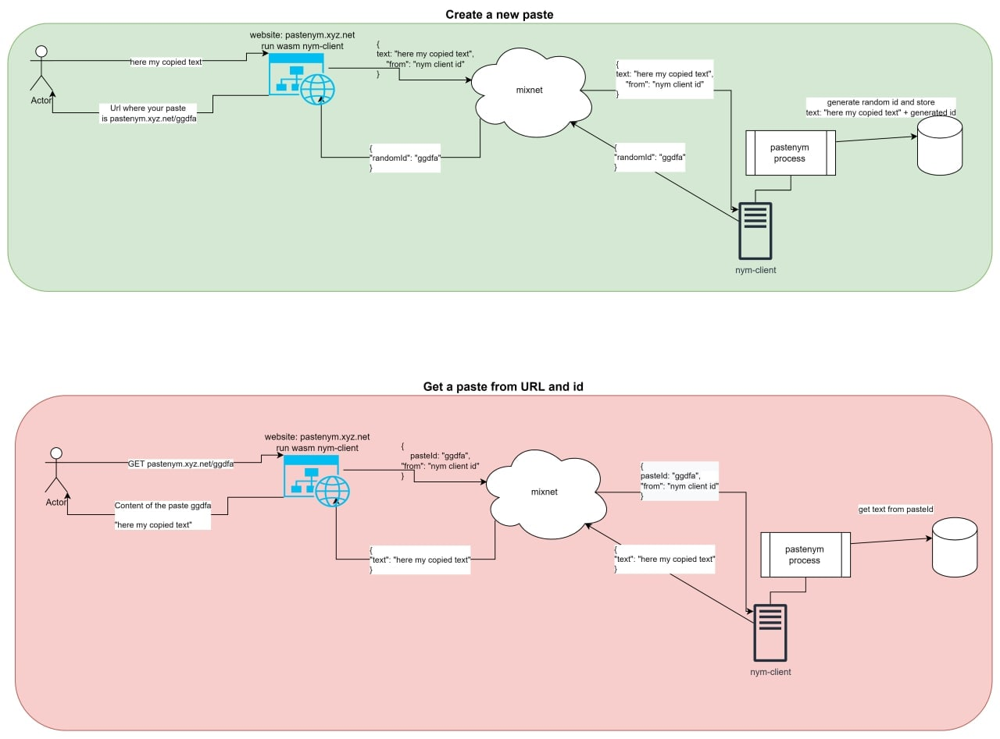

# pastenym

This project is inspired from [pastebin](https://pastebin.com/) service.
The main goal is to offer a solution for sharing text with [Nym](https://nymtech.net/) products to offer full anonymity, even on metadata level

Check [here](#with-docker) to run you own backend

#### Demo
Get shared text: [https://pastenym.ch/#/jD6Vhmrz&key=b2d6ae002a1674daa43a07be7fc4f01c](https://pastenym.ch/#/jD6Vhmrz&key=b2d6ae002a1674daa43a07be7fc4f01c)

Share a text: [http://pastenym.ch/](http://pastenym.ch/)

## What Nym is developping ?
> Nym is developing the infrastructure to prevent this data leakage by protecting every packet’s metadata at the network and application layers.

### Architecture


## How pastenym service will use Nym product
Your text is sent to a client which is connected to the Nym network and which stores it in a database (eventually a more distributed solution will be considered),


This system allows you to share information while respecting your privacy by protecting your data and metadata.

On the side of No Trust Verify we only see an anonymous id when sending the text, and therefore impossible to know who is behind and from where the data was sent. Moreover, data is end-to-end encrypted: your browser generates a key used to encrypt the text, the key is placed in the URL you share with your friends and is used in their browser to decrypt the text received by the server.

### Schema



## Init the project

First a nym-client should be started

### Nym client
1. Download [nym-client](https://github.com/nymtech/nym/releases/)
2. Give exec permissions and init the client
```bash
chmod u+x nym-client
./nym-client init --id pastenym
```
3. Run the client `./nym-client run --id pastenym`

It uses [pipenv](https://pipenv.pypa.io/en/latest/install/)

1. Go to `backend/`
2. `pipenv shell` to start the python env
3. `pipenv install` to install the dependancies from the PipFile
4. `python main.py` to start the service. On the first run, it will create and initialize a local database at `backend/data/data.db`.


### With Docker

```bash
git clone https://github.com/notrustverify/pastenym
cd pastenym
cp example.docker-compose.yml docker-compose.yml
cp env.docker.example env.docker
chown -R 10000:10000 nym-client/nym-data/

docker compose --build -d
```

To retrieve the nym-client id of the backend use `docker compose logs nym-client --since 10m| grep -E ".*address of this.*" `

## Contribute

If you wish to contribute to the project, you will need to run the Nym client and Backend as explained in the Init part above AND run a local frontend.

## Donate

If you enjoy pastenym, please consider buying us a cup of coffee. We worked hard to make it free and plan to spend alot of time supporting it. Donations are greatly appreciated.

* BTC: `bc1q5j4tq0yr75j90xwegwtfpaccdx3xdaxxzjtzt8`
* XMR: `48iCVNX1G2B7W2nAQQAEFW9Q8f3dbURekCGPdVYiNj6Xa8ur5Qpg6SXUHB4LyQqc4tBurtNr2NiavKgqX9tZSeK9GePGwj6`


*The best way to support us is by delegated NYM to our nodes*
* No Trust Verify 2 `4yRfauFzZnejJhG2FACTVQ7UnYEcFUYw3HzXrmuwLMaR`
* No Trust Verify 1 `APxUbCmGp4K9qDzvwVADJFNu8S3JV1AJBw7q6bS5KN9E`


### Frontend
Use the dedicated repository avalaible [here](https://github.com/notrustverify/pastenym-frontend)

## Structure

* `backend/` manage the websockets connections and DB
* [Frontend](https://github.com/notrustverify/pastenym-frontend) web application
* [CLI](https://github.com/notrustverify/pastenym-cli) application to interact with pastenym without the frontend
* `nym-client/` store the configuration,keys for the nym-client
* `resources/` store img or files for documentation
